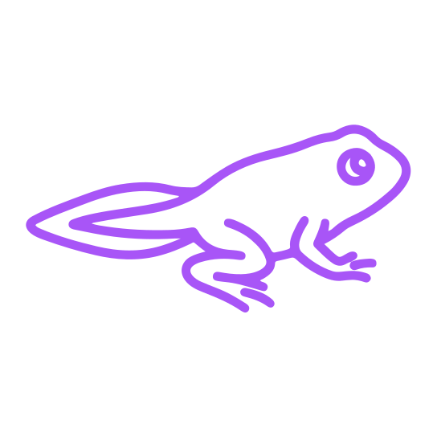
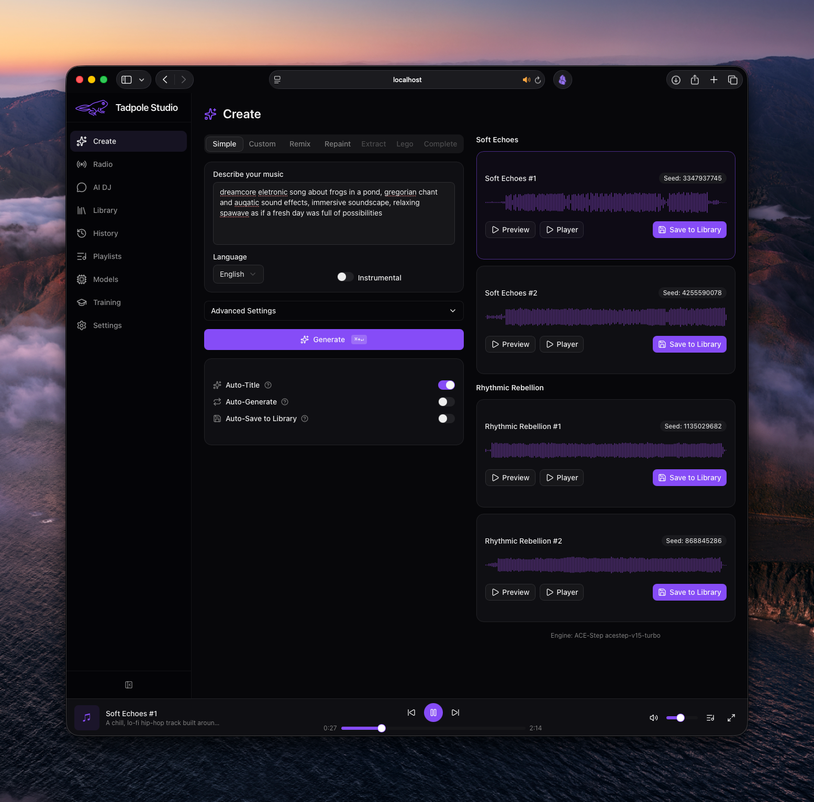
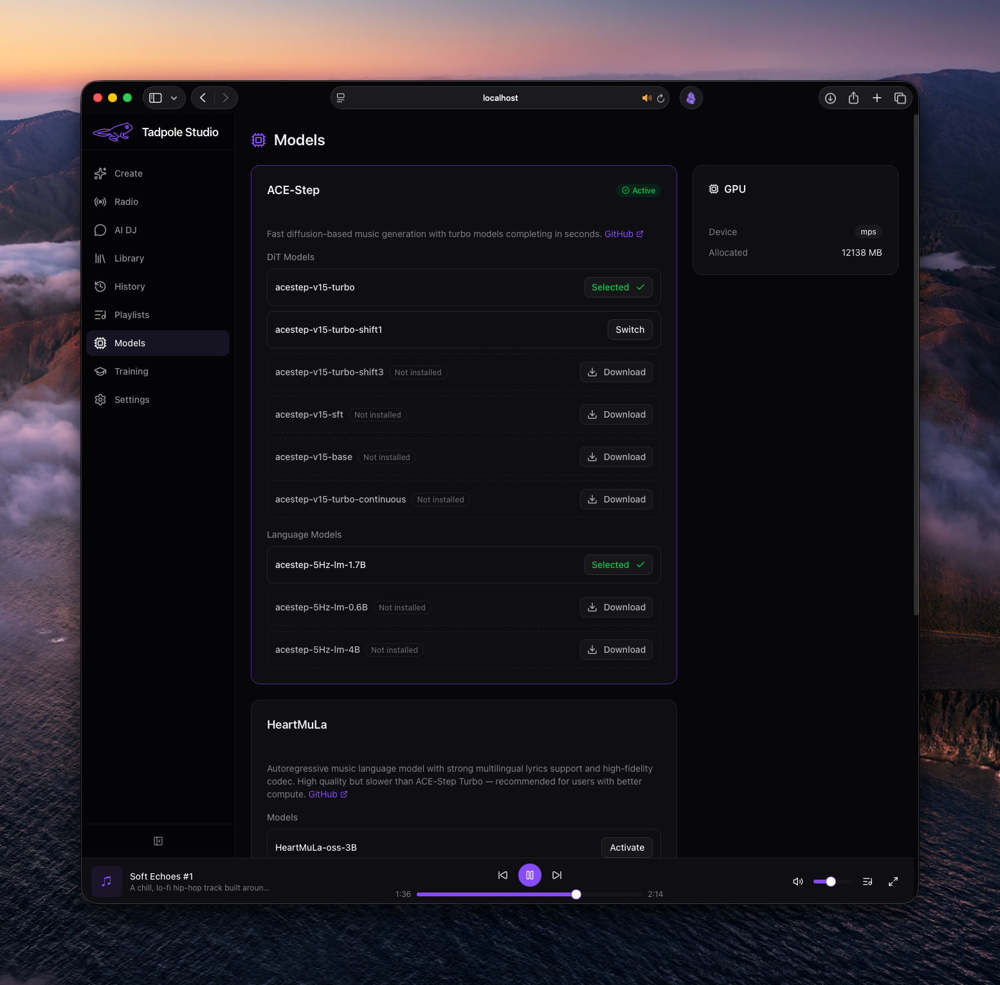
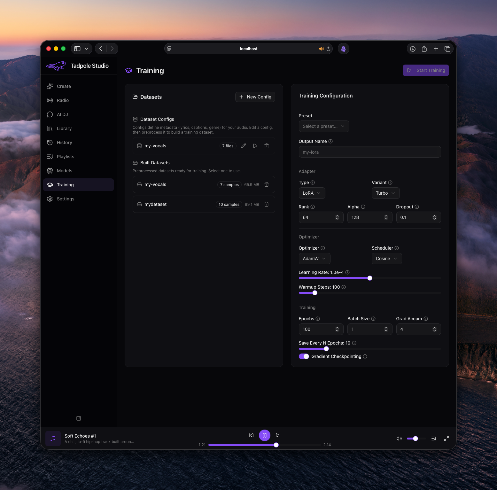

<div align="center">

<h1> Tadpole Studio</h1>

**Local-first AI music generation studio**


Generate, remix, and manage AI music entirely on your own machine.
Built on [ACE-Step 1.5](https://github.com/ace-step/ACE-Step-1.5).

[Features](#features) · [Screenshots](#screenshots) · [Quick Start](#quick-start) · [Configuration](#configuration) · [Credits](#credits--license)

</div>

## Screenshots

<table>
<tr>
<td align="center"><strong>Create</strong></td>
<td align="center"><strong>Models</strong></td>
<td align="center"><strong>Training</strong></td>
</tr>
<tr>
<td></td>
<td></td>
<td></td>
</tr>
<tr>
<td align="center"><sub>Generate music from text or full custom parameters</sub></td>
<td align="center"><sub>One-click model downloads and management</sub></td>
<td align="center"><sub>LoRA fine-tuning with dataset management</sub></td>
</tr>
</table>

## Features

### Music Generation

- **Text-to-Music (Simple Mode)** — describe what you want, get a song
- **Custom Mode** — full control over caption, lyrics, BPM, key, time signature, duration
- **Remix (Cover)** — upload or pick an existing song, transform it with AI
- **Repaint** — selectively regenerate portions of existing audio
- **Extract** — isolate individual tracks (vocals, drums, bass, etc.)
- **Lego** — generate a new track layer based on audio context
- **Complete** — fill in missing track classes for a partial mix
- **AutoGen** — automatic batch generation with optional auto-save

### AI DJ

- **Conversational music generation** — chat naturally to describe what you want to hear
- **Multiple LLM providers** — built-in MLX (Apple Silicon), [Ollama](https://ollama.com/) (install separately), OpenAI and Anthropic via your API key
- **Conversation history** — pick up where you left off with saved chat sessions
- **Auto-titling** — conversations are automatically named based on content

### Radio

- **Jukebox mode** — continuous, hands-free music generation
- **Station presets & custom stations** — create stations with specific genres, moods, and parameters
- **Auto-save to playlists** — automatically collect generated tracks
- **Radio ambiance** — vinyl crackle, static, and brown noise effects for that analog feel

### Library & Playlists

- **Library** — browse, search, filter, rate, and organize your generated music
- **Playlists** — create playlists with drag-and-drop reordering
- **Full Audio Player** — mini-player, full-screen overlay, queue, keyboard shortcuts

### Models & Training

- **Model management** — one-click downloads, model switching, and status tracking from the Models page
- **HeartMuLa backend** — alternative generation engine with great lyrics controllability
- **LoRA fine-tuning** — fine-tune models on your own audio datasets with presets

### Customization

- **11 built-in themes** — Midnight, Daylight, Ocean, Sunset, Sakura, Neon, Retro, Ember, Cafe, Vapor, Slate
- **Custom themes** — import your own CSS themes
- **GPU throttle tuning** — some tricks to minimize audio stuttering on Apple Silicon unified memory during continous generation

## Quick Start

### Prerequisites

| Tool | Version | Install |
|------|---------|---------|
| Python | 3.11+ | [python.org](https://www.python.org/downloads/) |
| uv | latest | [docs.astral.sh/uv](https://docs.astral.sh/uv/getting-started/installation/) |
| Node.js | 20+ | [nodejs.org](https://nodejs.org/) |
| pnpm | 9+ | [pnpm.io](https://pnpm.io/installation) |

### Clone & Run

```bash
git clone https://github.com/proximasan/tadpole-studio.git
cd tadpole-studio
python3 start.py        # macOS / Linux
python start.py         # Windows
```

That's it. The launcher:
- Checks prerequisites (Python, uv, Node.js, pnpm)
- Installs dependencies automatically on first run
- Starts the backend (port 8000) and frontend (port 3000)
- Opens your browser automatically once ready

On first launch the backend auto-downloads the default models from HuggingFace (~10 GB total):
- **acestep-v15-turbo** — DiT music generation model
- **acestep-5Hz-lm-1.7B** — lyrics formatting language model
- **Qwen2.5-1.5B-Instruct-4bit** — chat LLM for AI DJ & title generation

Make sure you have at least **10 GB of free disk space**.

Press `Ctrl+C` to stop both servers.

### Models & Hardware

The default turbo DiT (8-step) and 1.7B LM auto-download at startup. Additional models are available from the **Models** page:

**DiT models** — turbo (default), turbo-shift1, turbo-shift3, turbo-continuous, sft (50-step), base (50-step)

**Language models** — 1.7B (default), 0.6B (lightweight), 4B (best quality)

Recommended LM model by VRAM:

| VRAM | LM Model | Notes |
|------|----------|-------|
| ≤6 GB | none | DiT-only, no lyrics formatting |
| 6-8 GB | 0.6B | Lightweight, separate download |
| 8-16 GB | 1.7B (default) | Full features |
| 16-24 GB | 1.7B or 4B | Best quality with 4B |
| ≥24 GB | 4B | Maximum quality |

[HeartMuLa](https://github.com/HeartMuLa/heartlib) is also available as an alternative backend with its own 3B model (~21 GB download). It uses lazy-loading on macOS to fit in memory but runs slowly on Apple Silicon — a CUDA GPU is recommended for HeartMuLa.

### Flags

```bash
python3 start.py --install   # Force reinstall all dependencies
python3 start.py --no-open   # Don't auto-open browser
```

### Updating

```bash
git pull
python3 start.py        # macOS / Linux
python start.py         # Windows
```

The launcher automatically detects dependency changes after `git pull` and reinstalls as needed — including CUDA PyTorch on Windows.

To force a full reinstall: `python3 start.py --install`

<details>
<summary><strong>Manual Setup</strong></summary>

If you prefer to run things separately:

```bash
# Backend
cd backend
uv sync
uv sync --extra cloud-llm   # Optional: adds OpenAI & Anthropic for AI DJ
uv run tadpole-studio       # Starts on :8000

# Frontend (separate terminal)
cd frontend
pnpm install
pnpm dev                     # Starts on :3000
```

</details>

## Configuration

Environment variables (all optional, sensible defaults provided):

| Variable | Default | Description |
|----------|---------|-------------|
| `TADPOLE_HOST` | `0.0.0.0` | Backend bind address |
| `TADPOLE_PORT` | `8000` | Backend port |
| `TADPOLE_DEVICE` | `auto` | GPU device (`auto`, `cuda`, `mps`, `cpu`) |
| `TADPOLE_DIT_MODEL` | `acestep-v15-turbo` | Default DiT model |
| `TADPOLE_LM_MODEL` | `acestep-5Hz-lm-1.7B` | Default language model |
| `TADPOLE_LM_BACKEND` | `mlx` | LM backend (`mlx`, `transformers`) |
| `TADPOLE_AUDIO_FORMAT` | `flac` | Default output format |
| `TADPOLE_BATCH_SIZE` | `2` | Number of samples per generation batch |
| `ACESTEP_PROJECT_ROOT` | `backend/data` | Root data directory for checkpoints and assets |
| `HEARTMULA_MODEL_PATH` | `""` | Path to HeartMuLa model weights |
| `HEARTMULA_VERSION` | `3B` | HeartMuLa model version |
| `HEARTMULA_DEVICE` | `auto` | HeartMuLa device (`auto`, `cuda`, `mps`, `cpu`) |
| `HEARTMULA_LAZY_LOAD` | `false` | Lazy-load HeartMuLa model on first use |
| `TADPOLE_CORS_ORIGINS` | `http://localhost:3000,...` | Comma-separated CORS origins |

> **Cloud LLM keys** (OpenAI, Anthropic) are configured through the **Settings** page in the UI — no env vars needed.

## Keyboard Shortcuts

| Key | Action |
|-----|--------|
| `Space` | Play / Pause |
| `N` / `P` | Next / Previous track |
| `M` | Mute / Unmute |
| `E` | Expand / Collapse full player |
| `F` | Toggle favorite |
| `1`–`5` | Set rating |
| `←` / `→` | Seek backward / forward |

## Project Structure

```
tadpole-studio/
├── start.py                  # One-command launcher
├── backend/                  # Python — FastAPI + SQLite + ACE-Step
│   ├── src/tadpole_studio/
│   │   ├── main.py           # App entry, CORS, routers
│   │   ├── config.py         # Environment settings
│   │   ├── ace_handler.py    # TadpoleHandler (checkpoint resolution)
│   │   ├── backends/         # Music generation backends (ACE-Step, HeartMuLa)
│   │   ├── db/               # SQLite schema, connection, indexes
│   │   ├── routers/          # REST + WebSocket endpoints
│   │   │   ├── generation.py # Music generation
│   │   │   ├── dj.py         # AI DJ chat
│   │   │   ├── radio.py      # Radio stations
│   │   │   ├── themes.py     # Custom themes
│   │   │   └── ...           # Songs, playlists, models, training, etc.
│   │   ├── services/         # Generation, training, DJ, radio, LLM providers
│   │   ├── models/           # Pydantic request/response schemas
│   │   └── ws/               # WebSocket handlers
│   ├── data/                 # Runtime data (gitignored)
│   │   ├── checkpoints/      # ACE-Step model weights (auto-downloaded)
│   │   ├── audio/            # Generated music files
│   │   ├── loras/            # LoRA adapters
│   │   ├── datasets/         # Training datasets
│   │   ├── chat-llm/         # Local chat LLM weights
│   │   └── heartmula/        # HeartMuLa model weights
│   └── tests/                # pytest + httpx
├── frontend/                 # TypeScript — Next.js + React 19
│   └── src/
│       ├── app/              # Page routes (create, dj, radio, library, etc.)
│       ├── components/       # UI components by feature
│       │   ├── create/       # Music generation forms
│       │   ├── dj/           # AI DJ chat interface
│       │   ├── radio/        # Radio station player
│       │   ├── settings/     # Settings & theme picker
│       │   └── ...           # Library, playlists, models, training, layout
│       ├── hooks/            # Custom React hooks
│       ├── stores/           # Zustand state management
│       ├── themes/           # Built-in themes (11 themes)
│       ├── lib/              # API client, utilities, audio helpers
│       └── types/            # TypeScript interfaces
├── screenshots/              # README screenshots
└── LICENSE
```

## Tech Stack

<table>
<tr>
<td valign="top"><strong>Backend</strong></td>
<td valign="top"><strong>Frontend</strong></td>
</tr>
<tr>
<td valign="top">

- [FastAPI](https://fastapi.tiangolo.com/) — async API
- [SQLite](https://www.sqlite.org/) — WAL mode, optimized
- [ACE-Step 1.5](https://github.com/ace-step/ACE-Step-1.5) — music generation
- [uvicorn](https://www.uvicorn.org/) — ASGI server

</td>
<td valign="top">

- [Next.js 16](https://nextjs.org/) — React framework
- [React 19](https://react.dev/) — UI library
- [Tailwind CSS v4](https://tailwindcss.com/) — styling
- [Radix UI](https://www.radix-ui.com/) — accessible components
- [Zustand](https://zustand-demo.pmnd.rs/) — state management
- [TanStack Query](https://tanstack.com/query) — data fetching
- [WaveSurfer.js](https://wavesurfer.xyz/) — audio visualization
- [Motion](https://motion.dev/) — animations

</td>
</tr>
</table>

## Running Tests

```bash
# Backend
cd backend && uv run pytest -v

# Frontend
cd frontend && pnpm test --run
```

## Credits & License

Tadpole Studio is built on top of [ACE-Step 1.5](https://github.com/ace-step/ACE-Step-1.5).

Community inspirations:
- **AI DJ** — inspired by [clockworksquirrel/ace-step-apple-silicon](https://github.com/clockworksquirrel/ace-step-apple-silicon)
- **Radio** — inspired by [nalexand/ACE-Step-1.5-OPTIMIZED](https://github.com/nalexand/ACE-Step-1.5-OPTIMIZED) and [PasiKoodaa/ACE-Step-RADIO](https://github.com/PasiKoodaa/ACE-Step-RADIO)

Licensed under the [MIT License](LICENSE).

